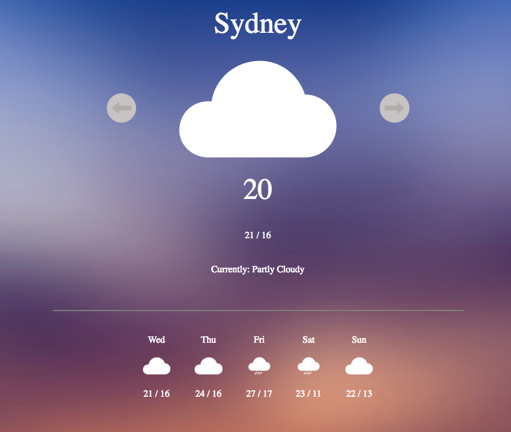

# Project Overview

The Weather app generates the current and the next 5 days weather conditions for 5 cities around the globe: Sydney, Rome, Miami, Bogota and Shanghai. It uses DarkSky api to access the locations weather information displaying also the maximum and mininimum temperature for each day. The Backend is built using NodeJs and the front end with Jquery, Javascript ans SCSS.

Webpack was used to bundle all SCSS and JS files. The app is responsive to different viewports and is 100% progressive.

## Tools

The application was built using the Webpack, NodeJS, Javascript, Jquery and SCSS.

# Running the app

### `$ git clone https://github.com/andresrgallo/weather-app`

### `$ cd weather-app`

### `$ npm install`

In the project directory, you can run:

### `npm run webpack`

and a 'build' folder will be created containing all your assets built by Webpack

### `node src/server.js

to run node server at port 3000

### `npm start`

to see the application on the browser at
['http://localhost:8080/']('http://localhost:8080/').

## Note:

The application is totally progressive and responsive.

